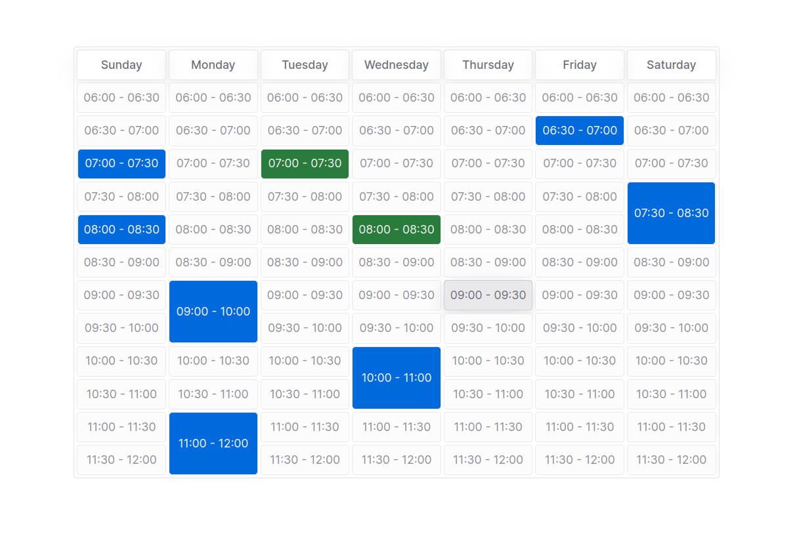

# Appointment Week

It is a react component to show appointment by week in a table.



## How to Use it

Here is the list of props it accepts and its uses. Required prop has italicized text.

### List of Props

- `className`: Will attach class to the table.
- `from`: The start time for the slots (24hr format). Default value is `{hours: 0}`
- `to`: End time for the slots (24hr format). Default value is `{hours: 24}`

  ```jsx
  <AppointmentPicker from={{ hours: 6 }} to={{ hours: 13 }} />
  ```

- _`appointments`_: An array of appointments for the week
- _`dateOfWeek`_: Any day of the week
- _`renderSlot`_: It is a render prop and responsible for rendering slots. It gets `slot` and `onClick` as its argument.
- _`renderTitle`_: It is render prop to render the title
- `maxReservation`: Max number of reservation user can select. Default value is 3.
- `slotDuration`: Defines the slot duration in minutes. Default value is 30 min.

## Example

```jsx
<AppointmentPicker
  className="content"
  from={{ hours: 6 }}
  to={{ hours: 12 }}
  appointments={DUMMY_APPOINTMENT_DATA}
  dateOfWeek={new Date()}
  renderSlot={(slot, onClick) => {
    const isReserved = slot.slotType === "RESERVED";
    const isSelected = slot.slotType === "AVAILABLE" && slot.isSelected;
    return (
      <div
        className={`slot ${isReserved ? "reserved" : "available"} ${
          isSelected ? "selected" : ""
        }`}
        onClick={() => onClick(slot.id)}
      >
        {formatSlotTime(slot.startTime, slot.endTime)}
      </div>
    );
  }}
  renderTitle={(date) => (
    <div className={`group-title`}>{formatSlotTitle(date)}</div>
  )}
  maxReservationAllowed={3}
  slotDuration={30}
/>
```

## Work in progress 🟠

- Fix error 🔴 Slots time should be with in start and end time.
- Add styles to the `Basic Example`
- Add 12 hour format
- check for from and to
  - 26 (should throw an error or default to 24)
- Make the render props optional and show default title and slot
